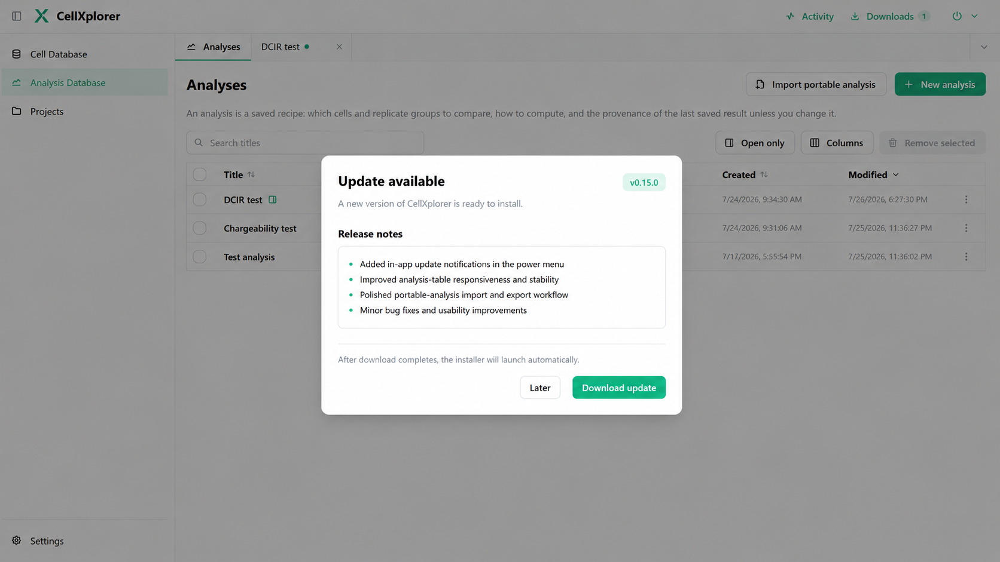
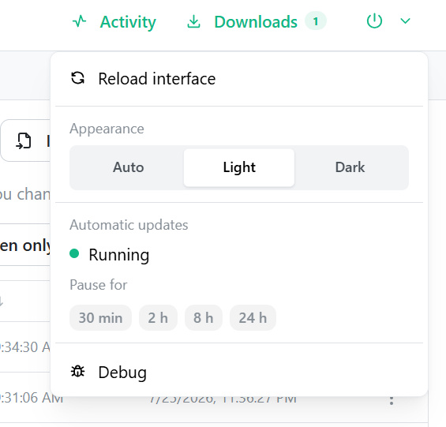

# Spec 018: In-app update experience

Status: **implemented** (review follow-ups R1–R7 addressed on `feature/updater-017-019`).

Repository: `mattiafelice-palermo/cellxplorer`  
Target branch: `feature/updater-017-019` (shared with Specs 017 and 019; merge once when all three are complete)  
Base: `feature/updater-017-019` **after Spec 017 is complete on this branch**  
Dependency: Spec 017 — secure Tauri updater foundation  
Review document: `docs/specs/reviews/018-in-app-update-experience-review.md`

## 1. Goal

Expose signed CellXplorer updates through the existing top-right power menu:

- check automatically in the packaged application without delaying startup;
- show a clear indicator when a newer stable release exists;
- add an update action as the final power-menu entry;
- show only the newest release and its release notes in a compact modal;
- download inside that same modal with real progress;
- automatically launch the already-downloaded NSIS installer when complete.

The update check and download are application-maintenance state. They do not belong in the FastAPI backend, normal Downloads history or scientific background-job system.

## 2. Visual references

### Requested update modal



### Current power menu



The requested modal composition is locked. Where an image is ambiguous, the written rules below and `docs/agent-knowledge/visual-style-guide.md` win. All chrome must support Light, Dark and Auto; the mockup only shows Light.

## 3. Locked product behavior

### 3.1 Power-menu placement

Keep the existing power button and current menu structure. Add one separated update item as the **last item in the entire menu**, after Debug.

Packaged-app states:

| State | Final menu item |
|---|---|
| no known update | `Check for updates` |
| checking | `Checking for updates…` — disabled with spinner |
| update available | `Update to vX.Y.Z` |
| modal/download active | `Updating to vX.Y.Z…` — disabled |

In browser development mode, hide this final item entirely unless the explicit development mock described in §7 is enabled.

The current menu section labelled **Automatic updates** actually pauses source monitoring and cache warmup, not application releases. Rename that section to **Background automation** so the two concepts cannot be confused. Preserve its current status, pause presets and behavior.

### 3.2 Power-button indicator

Preserve the existing amber paused-automation indicator.

When an application update is available, add a separate compact teal badge containing `1`, visually matching the small count badge used by Downloads. It must not shift the header layout.

If background automation is paused and an app update is available at the same time, both states must remain visible. Do not let one replace or recolor the other.

The update badge has an accessible description such as `1 application update available`; it cannot rely on color alone.

### 3.3 Automatic checking

Only run in the Tauri application.

- First automatic check: approximately 10 seconds after the normal app shell mounts, or sooner
  when the configured interval is shorter.
- Repeat while the app remains open: at the user-configured interval (default: every 12 hours).
- A manual `Check for updates` action always checks immediately.
- Do not block backend/database startup, normal navigation or the first render.
- Do not add an update channel.

The **Settings → App updates** tab stores process-local update preferences in browser local
storage:

- interval value: positive integer;
- interval unit: seconds, minutes, hours or days;
- automatic discovery toaster: enabled by default.

Changing the preference reschedules the coordinator immediately. Disabling the toaster does not
disable update checks or the persistent power-button update badge.

Automatic-check failures are silent in the main UI but must be added to the existing frontend debug-event log.
Manual-check failures open the update modal with the current installed version and a plain-language
explanation (not a bottom-corner notification). Manual “up to date” results use the same modal.

### 3.4 Notification behavior

When a newly discovered version is newer than the installed version:

- when enabled in settings, show one standard Mantine notification:
  `CellXplorer vX.Y.Z is available.`;
- include an action that opens the update modal;
- keep the power-button badge until that version is installed or no longer reported;
- do not open the modal automatically.

Show the notification at most once per version on the current Windows user profile. Store only the notified version in local storage, for example:

```text
cellxplorer-update-notified-version
```

Do not store the manifest, download URL, signature, release notes or updater object in local storage.

A manual check may open the update modal with `You’re up to date` and the current version when
nothing is available. Automatic checks must not show that success message.

### 3.5 Initial modal — exact content scope

The initial modal shows **only the latest available release**.

Required content:

1. title: `Update available`;
2. dynamic version badge: `vX.Y.Z`;
3. subtitle: `A new version of CellXplorer is ready to install.`;
4. section heading: `Release notes`;
5. a compact bordered release-note well;
6. helper text: `After download completes, the installer will launch automatically.`;
7. footer buttons: `Later` and primary `Download update`.

Do not show:

- current version;
- release history or older versions;
- publication date;
- asset filenames or download URL;
- update channel selector;
- technical signature details;
- a separate confirmation popup after `Download update`.

The version and notes come from the signed updater manifest. Never hardcode `v0.15.0`; it is illustrative in the mockup.

The modal has no close `X`. `Later`, Escape and overlay click may close it only before downloading. Once download starts, it becomes non-dismissible.

### 3.6 Release-note rendering

Treat manifest notes as untrusted plain text.

- Do not use `dangerouslySetInnerHTML`.
- Support simple newline-separated text and Markdown-style leading `-`/`*` bullets.
- Render a bounded scroll area when notes are long; keep the modal footer visible.
- Preserve useful line breaks but do not implement general Markdown/HTML rendering.
- Empty notes fall back to `This release includes improvements and bug fixes.`

### 3.7 Download and installer sequence

Use the three narrow Rust commands from Spec 017. Do not import or call the generic JavaScript updater binding directly.

Exact sequence after `Download update`:

1. If any analysis editor is dirty, use the existing `hasDirtyAnalysisWorkspaceEditors()` guard and ask for confirmation **before** starting. Explain that the installer will close CellXplorer and unsaved plot changes will be lost.
2. Keep the modal open and make it non-dismissible.
3. Invoke `download_app_update` with the expected version and a Tauri IPC `Channel`.
4. Show the channel's real progress events in the same modal.
5. The command returns only after the complete installer has been downloaded and its Tauri signature verified. Show `Download complete. Launching installer…` and a full progress bar.
6. Best-effort `POST /api/session/finish`, using the same session-closing path as normal quit.
7. Immediately invoke `install_app_update` with the same expected version.
8. The Rust `Update::install` path runs its `on_before_exit` hook, stops the Python sidecar, exits CellXplorer and opens the branded NSIS installer in `basicUi` mode.

Do not download the setup executable into the user's configured export folder and do not add it to the header Downloads count/history.

### 3.8 Download progress

Tauri progress events are authoritative:

- `started`: capture `contentLength` when available;
- `progress`: add `chunkLength` to downloaded bytes;
- `finished`: mark the download complete.

When total bytes are known, show:

- a determinate teal progress bar;
- percentage;
- downloaded and total sizes in human-readable units.

When total bytes are missing or zero, show an animated indeterminate bar and downloaded bytes only. Do not invent a percentage from elapsed time.

Use one progress bar for this operation. Do not also create a background-job entry or header activity spinner.

### 3.9 Failure and recovery

#### Check failure

- automatic: debug log only;
- manual: update modal with plain-language explanation and current version; menu returns to `Check for updates`.

#### Download failure

The app and backend remain running. Keep the modal open with an inline red Alert and actions:

- `Later`;
- `Retry download`.

Keep the release notes visible.

#### Installation-launch failure

Distinguish two Windows boundaries:

1. **Pre-hook errors** — `install_app_update` returns before `on_before_exit`. The backend is still
   alive, but `/api/session/finish` may already have closed the current diagnostic session. Show an
   inline red Alert with the specific safe error message and a primary `Restart CellXplorer` action
   using the existing `restart_app` command. Do not let the user dismiss the modal and continue in a
   session whose lifecycle record may already be closed. Do not fall back to
   `window.location.reload()` in the packaged app.
2. **Post-hook path** — once the updater plugin runs `on_before_exit`, CellXplorer and the backend
   exit. Upstream Tauri 2.10 does not inspect `ShellExecuteW` success before exiting, so the
   frontend must treat a successful install invocation as non-returning and must not design UI
   recovery for a failed Windows installer open after that point.

### 3.10 No automatic restart after installer launch

Do not call Tauri's generic process relaunch API after `install_app_update`. On Windows, the updater exits the app while launching the interactive NSIS installer, which owns completion and its existing launch option. This avoids racing CellXplorer's single-instance lock and Python sidecar.

## 4. Current implementation anchors

Read before editing:

- `AGENTS.md`
- `docs/agent-knowledge/README.md`
- `docs/agent-knowledge/visual-style-guide.md`
- `docs/agent-knowledge/change-playbooks.md`
- Spec 017 and its implementation/review
- `frontend/src/components/QuickSettingsMenu.tsx`
  - current power-button `Indicator`;
  - reload/restart handlers;
  - Appearance;
  - paused background automation;
  - Debug currently last.
- `frontend/src/App.tsx`
  - header mounting of `QuickSettingsMenu`;
  - existing notification/debug facilities;
  - Tauri-only event setup;
  - avoid adding a large updater state machine directly to this file.
- `frontend/src/analysisWorkspace.ts::hasDirtyAnalysisWorkspaceEditors`
- `frontend/src/downloads.ts::isTauriApp`
- `frontend/src/debug.ts::addDebugEvent`
- `frontend/src/api.ts::{get, post}`
- the Spec 017 Rust updater commands and managed pending-update state:
  - `check_app_update`;
  - `download_app_update`;
  - `install_app_update`;
- `src-tauri/tauri.conf.json` updater configuration from Spec 017

Official updater API reference: `https://v2.tauri.app/plugin/updater/`

## 5. Frontend architecture

### 5.1 Keep updater state outside `App.tsx` and the menu

Add a small dedicated domain/service layer and coordinator. Suggested structure:

```text
frontend/src/appUpdater.ts
frontend/src/components/AppUpdateCoordinator.tsx
frontend/src/components/AppUpdateModal.tsx
frontend/tests/appUpdater.test.ts
```

`App.tsx` should mount the coordinator/provider and pass or consume only the small public update interface needed by `QuickSettingsMenu`.

`QuickSettingsMenu.tsx` remains responsible for menu rendering, not update networking or download state.

### 5.2 State model

Use one explicit state machine or reducer. A suitable public shape is:

```ts
type UpdateCheckSource = "automatic" | "manual";
type UpdateFailurePhase = "check" | "download" | "install";

type AppUpdateState =
  | { status: "idle" }
  | { status: "checking"; source: UpdateCheckSource }
  | { status: "upToDate" }
  | { status: "available"; release: AppUpdateRelease }
  | {
      status: "downloading";
      release: AppUpdateRelease;
      downloadedBytes: number;
      totalBytes: number | null;
    }
  | { status: "launching"; release: AppUpdateRelease }
  | {
      status: "error";
      phase: UpdateFailurePhase;
      message: string;
      release?: AppUpdateRelease;
      lifecycleMayNeedRestart?: boolean;
    };
```

`AppUpdateRelease` should expose only serializable display metadata such as version and notes. The live Tauri `Update` and verified installer bytes remain in Spec 017's managed Rust state; do not duplicate them in React Query, local storage or frontend JSON state.

### 5.3 Public coordinator interface

Expose compact actions such as:

```ts
checkForUpdate(source: UpdateCheckSource): Promise<void>
openUpdateModal(): void
closeUpdateModal(): void
downloadAndLaunchInstaller(): Promise<void>
retryDownload(): Promise<void>
restartAfterInstallFailure(): Promise<void>
```

Use `invoke` from `@tauri-apps/api/core` for checks/install and a Tauri IPC `Channel` for download progress. Keep command names and payloads typed in one service module rather than scattering raw strings across components.

Use React state/context rather than React Query: this is process-local Tauri state, not backend-owned server state.

Ensure effects are cleaned up on unmount and prevent overlapping checks/downloads.

### 5.4 Safe concurrency

- Coalesce simultaneous automatic/manual check requests into one in-flight check.
- Never start a second download while one is active.
- Ignore stale check results after component disposal.
- If an automatic check finishes while the modal is already showing a known update, do not replace it with an older/equal version.
- A fresh successful check replaces Rust pending-update state; do not assume an older version remains downloadable after another check.

## 6. Detailed UI behavior

### 6.1 Menu item

Use a familiar Tabler update/download icon at 14 px and standard `Menu.Item` geometry. Add a divider before the final update item so it remains visibly separate from Debug.

For `Update to vX.Y.Z`, use normal text plus a small teal badge if useful; do not make the whole row a large promotional element.

The item must be keyboard reachable and its loading/disabled state must have an accessible label.

### 6.2 Modal geometry

Follow the approved mockup and visual guide:

- centered Mantine `Modal`;
- approximately 580–620 px wide (`size` or deliberate rem width);
- `radius="md"`;
- light modal shadow and default overlay;
- compact `md` padding and `sm` section gaps;
- title and version badge in one no-wrap group;
- release-note well as `Paper withBorder radius="md" p="sm"`;
- standard modal action sizes: secondary `variant="default"`, primary filled teal;
- no gradients or decorative animation.

For Dark mode, use semantic surfaces or `light-dark(...)`; no new chrome hex literals.

### 6.3 Download state in the same modal

Do not open a second modal. Preserve title, version and release notes, then replace the helper/footer area with:

- status label `Downloading update…`;
- progress bar;
- percentage/byte details when available.

During `launching`, show a full bar and `Download complete. Launching installer…` with no active button.

### 6.4 Dismissal rules

| State | Later / Escape / overlay |
|---|---|
| available | allowed |
| download error before sidecar stop | allowed |
| downloading | blocked |
| launching | blocked |
| install error after sidecar stop | blocked until Restart CellXplorer |

The user must not be able to close a modal that represents a stopped backend and return to a broken-looking app.

## 7. Development-only updater mock

A real update cannot be safely tested from the browser dev server. Add a narrowly scoped development mock that is tree-shaken or disabled in production.

Acceptable mechanism:

```text
?mockUpdate=available
?mockUpdate=download
?mockUpdate=unknown-size
?mockUpdate=download-error
?mockUpdate=install-error
```

Requirements:

- active only when `import.meta.env.DEV` is true;
- never changes production behavior;
- uses the same state reducer and UI as the Tauri implementation;
- simulates chunked progress without pretending that the actual installer launches;
- clearly logs that mock mode is active.

Do not add a visible production debug switch.

## 8. Tests

### 8.1 Pure policy tests

Add `frontend/tests/appUpdater.test.ts` covering at least:

- automatic versus manual no-update behavior;
- once-per-version notification rule;
- progress accumulation and percentage calculation;
- unknown content length;
- duplicate/overlapping check suppression;
- download failure returns to retryable state;
- installation failure marks `lifecycleMayNeedRestart`;
- safe release-note parsing/fallback;
- menu label for each state;
- update badge independent from paused-automation state.

Prefer pure exported helpers/reducer tests. Do not require a live Tauri runtime for these tests.

### 8.2 Frontend verification

Run:

```powershell
node --test frontend\tests\appUpdater.test.ts
cd frontend
npx tsc --noEmit
npm.cmd run build
```

Then run:

```powershell
python scripts\preflight.py
```

Record exact results.

### 8.3 Manual browser verification using the DEV mock

Check at minimum:

- current power menu with no update;
- update badge and final menu item;
- paused automation plus update available simultaneously;
- approved initial modal composition;
- determinate and indeterminate progress;
- download and install errors;
- dirty-workspace confirmation;
- keyboard navigation and Escape rules;
- Light, Dark and Auto;
- 70%, 100%, 130% and 160% UI zoom;
- long release notes scroll without moving the decision footer.

### 8.4 Packaged verification deferred to Spec 019

This branch cannot prove that a public signed release downloads and launches the real installer. Record that as unverified rather than manufacturing a success claim. The complete installed-version-to-new-version test belongs to Spec 019.

## 9. Files expected to change

Likely minimum:

```text
frontend/src/App.tsx
frontend/src/appUpdater.ts
frontend/src/components/AppUpdateCoordinator.tsx
frontend/src/components/AppUpdateModal.tsx
frontend/src/components/QuickSettingsMenu.tsx
frontend/tests/appUpdater.test.ts
docs/specs/README.md
docs/specs/018-in-app-update-experience.md
docs/specs/assets/018-in-app-update-experience.png
docs/specs/assets/018-current-power-menu.png
```

Update `AGENTS.md` maintained tree if the new components/domain file make the existing map misleading.

No backend file should need modification unless the existing `/api/session/finish` route is proven insufficient. Do not broaden the backend scope pre-emptively.

## 10. Out of scope

- GitHub release build/upload automation;
- update channels or beta releases;
- update settings page;
- background/silent installation;
- installer redesign;
- Windows Authenticode signing;
- rollback;
- resuming a partial download after application restart;
- showing multiple releases or full changelog history;
- adding update downloads to the ordinary Downloads list;
- version/changelog bump or publishing a release.

The combined updater feature receives one minor release bump in Spec 019. Do not publish or tag Spec 018 independently.

## 11. Implementation order

1. Copy the spec and two assets into `docs/specs/` and update the index.
2. Read Spec 017 implementation/review and confirm the three real Rust updater commands and payloads are available.
3. Implement pure update-state and release-note helpers with tests.
4. Implement coordinator/provider and automatic/manual checking.
5. Add notification and independent power-button badge.
6. Rename `Automatic updates` to `Background automation` and add the final menu item.
7. Implement the approved initial modal.
8. Implement same-modal download progress and exact install sequence.
9. Implement error/recovery states.
10. Add the development-only mock.
11. Run tests/build/preflight and perform the browser verification matrix.
12. Record packaged installer launch as deferred to Spec 019.

## 12. Acceptance checklist

- [ ] Packaged CellXplorer checks after startup and every 12 hours without delaying normal use.
- [ ] Manual check works from the final power-menu item.
- [ ] Automatic failures are silent but debuggable; manual failures open the update modal with a plain-language explanation.
- [ ] A new version shows one notification per version and a persistent independent teal `1` badge.
- [ ] Paused background automation and update availability can be shown simultaneously.
- [ ] The background pause section is relabelled `Background automation` without behavior changes.
- [ ] The initial modal matches the approved composition and shows only the latest release.
- [ ] Notes are rendered as safe plain text with bounded overflow.
- [ ] Download progress remains in the same non-dismissible modal and uses real byte events.
- [ ] Dirty editors are confirmed before downloading.
- [ ] On completion, CellXplorer finishes the session, stops the sidecar and automatically launches the installer.
- [ ] Download failure is retryable without stopping the backend.
- [ ] Install-launch failure offers a working full-app restart, not a page reload.
- [ ] Update downloads never enter normal export Downloads history.
- [ ] Browser mock states, Light/Dark/Auto, keyboard access and UI zoom are manually verified.
